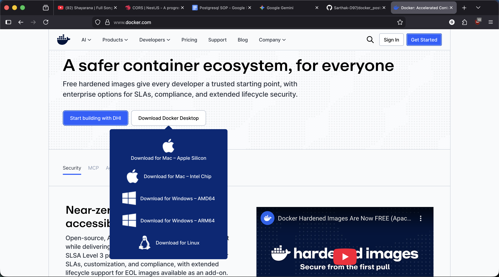
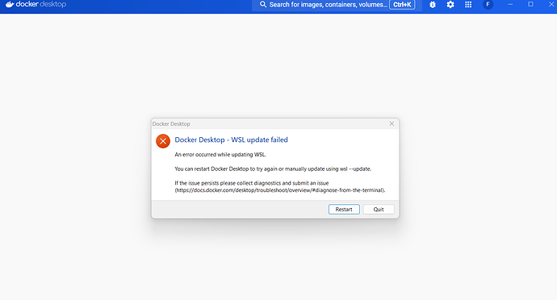
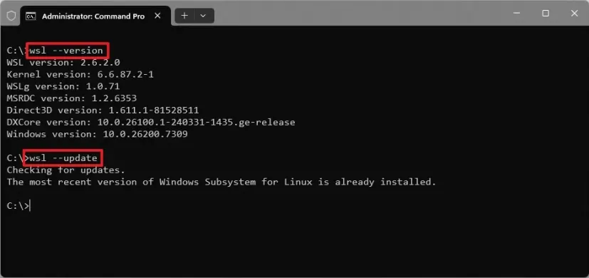
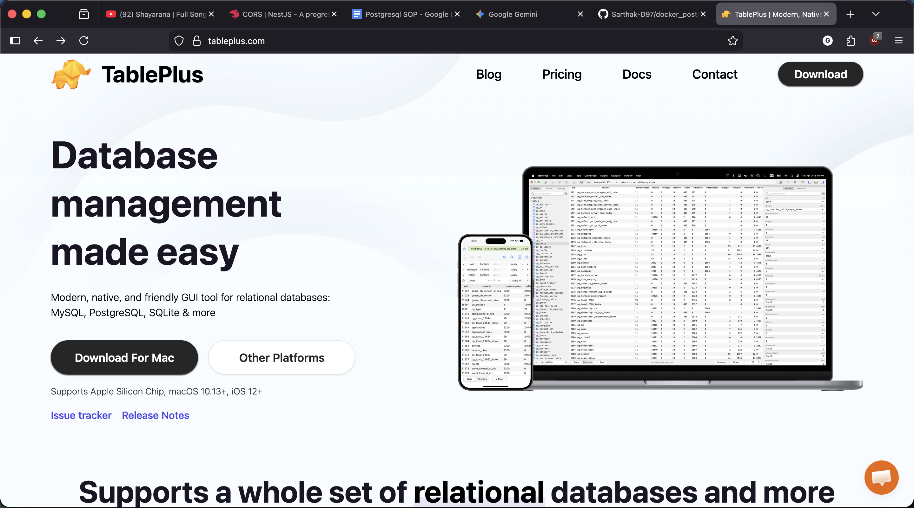
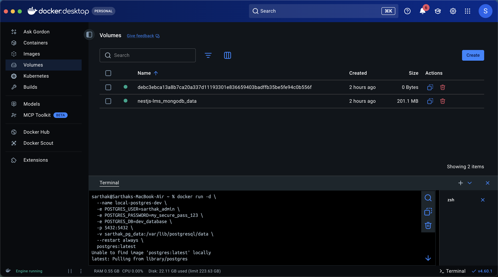
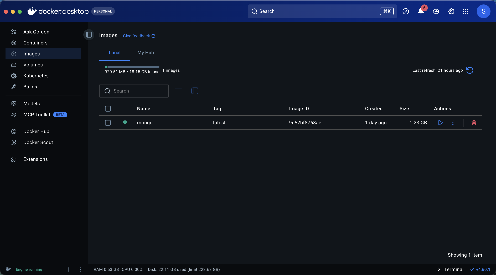
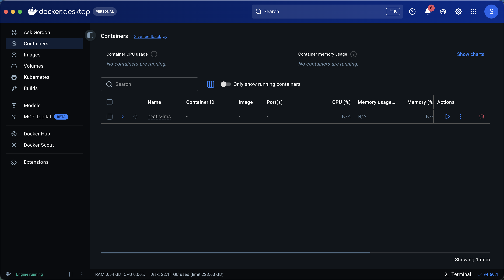
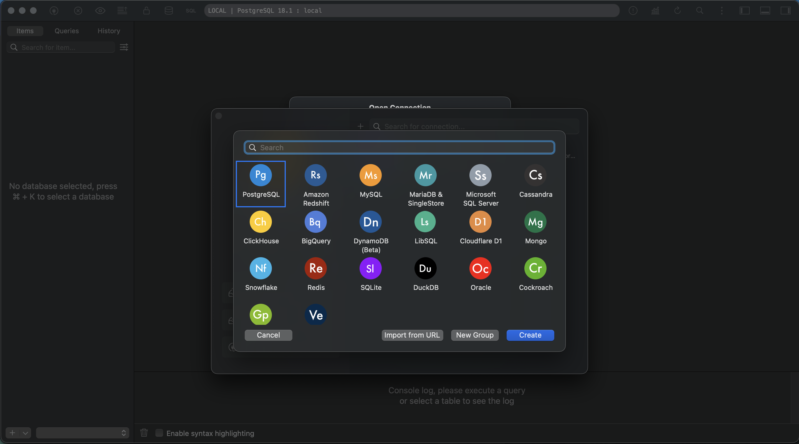
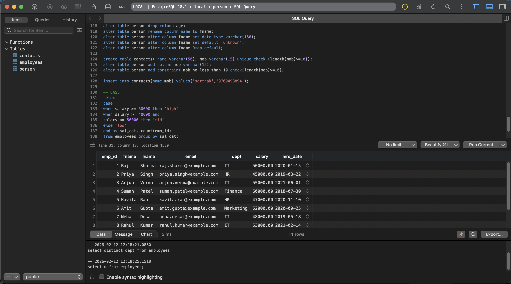

## 🐘 Professional SOP: PostgreSQL Environment Setup

---

**Stack:** Docker Desktop + WSL 2 (Windows) / Native (macOS) + TablePlus UI
**Author:** Sarthak Chauhan
**Date:** February 12, 2026

---

## 📑 Table of Contents

1. [Prerequisites & System Architecture](https://www.google.com/search?q=%231-prerequisites)
2. [Phase 1: Docker Desktop Installation](https://www.google.com/search?q=%23phase-1)
3. [Phase 2: Windows Subsystem for Linux (WSL 2) Setup](https://www.google.com/search?q=%23phase-2)
4. [Phase 3: TablePlus UI Installation](https://www.google.com/search?q=%23phase-3)
5. [Phase 4: Deploying PostgreSQL via Docker](https://www.google.com/search?q=%23phase-4)
6. [Phase 5: Connecting TablePlus to PostgreSQL](https://www.google.com/search?q=%23phase-5)
7. [Phase 6: Maintenance & Troubleshooting](https://www.google.com/search?q=%23phase-6)

---

<a name="1-prerequisites"></a>

## 0. Prerequisites & System Architecture

Before starting, understand the flow:

* **Docker:** Acts as the "Engine" that runs PostgreSQL in an isolated environment.
* **WSL 2 (Windows Only):** Provides the Linux kernel required for Docker to run with high performance.
* **TablePlus:** The "Cockpit" where you visually manage your data and run queries.

---

<a name="phase-1"></a>

## Phase 1: Docker Desktop Installation

### 1.1 Download the Installer

Go to the [Docker Desktop Official Site](https://www.docker.com/products/docker-desktop/) and select your OS.

### 1.2 Installation Steps (Windows)

1. Run the `.exe` installer.
2. **Important:** Ensure the checkbox **"Use WSL 2 instead of Hyper-V"** is checked.
3. Once finished, Windows will likely require a **System Restart**.

### 1.3 Installation Steps (macOS)

1. Open the `.dmg` file.
2. Drag the **Docker** icon into the **Applications** folder.
3. Launch Docker from Applications.
4. **Identify your Chip:** * `Apple Silicon` (M1/M2/M3) users select the ARM64 version.
* `Intel` users select the x86_64 version.




---

<a name="phase-2"></a>

## Phase 2: Windows Subsystem for Linux (WSL 2) Setup

*Note: If you are on macOS, skip this phase as it is handled natively by Docker Desktop.*

Windows requires a Linux backend to run Docker containers natively. If Docker Desktop prompts that WSL is missing, follow these steps:



### 2.1 Enable WSL Features

1. Open **PowerShell** or **Command Prompt** as **Administrator**.
2. Execute the following command:

```powershell
wsl --install

```

3. If WSL is already installed, ensure it is updated to the latest kernel version:

```powershell
wsl --update

```

### 2.2 Set WSL 2 as Default

Ensure all new Linux distributions use version 2:

```powershell
wsl --set-default-version 2

```



---

<a name="phase-3"></a>

## Phase 3: TablePlus UI Installation

1. Visit [TablePlus.com](https://tableplus.com/).
2. Download the version corresponding to your OS.
3. **Installation:**
* **Windows:** Follow the standard `.exe` setup wizard.
* **macOS:** Open the `.dmg` and move to Applications.


4. **Initial Launch:** Open TablePlus. It may ask to install a helper tool for the CLI; click **Install**.



---

<a name="phase-4"></a>

## Phase 4: Deploying PostgreSQL via Docker

We will deploy PostgreSQL with **Data Persistence**. This ensures that if you delete the container, your data remains safe in a Docker Volume.

### 4.1 Create a Persistent Volume

Open your Terminal (Mac) or PowerShell (Windows) and run:

```bash
docker volume create sarthak_pg_data

```

### 4.2 Run the PostgreSQL Container

Copy and paste this exact command. It configures the port, credentials, and data storage:

```bash
docker run -d \
  --name local-postgres-dev \
  -e POSTGRES_USER=sarthak_admin \
  -e POSTGRES_PASSWORD=my_secure_pass_123 \
  -e POSTGRES_DB=dev_database \
  -p 5432:5432 \
  -v sarthak_pg_data:/var/lib/postgresql/data \
  --restart always \
  postgres:latest

```



### 🔍 Command Breakdown:

* `--name`: The nickname for your container.
* `-e`: Sets environment variables (User, Password, Database Name).
* `-p 5432:5432`: Maps your machine's port to the container's port.
* `-v`: Attaches the volume we created to the internal Postgres data folder.
* `--restart always`: Ensures the DB starts automatically when you reboot your PC.




---

<a name="phase-5"></a>

## Phase 5: Connecting TablePlus to PostgreSQL

1. Open **TablePlus**.
2. Click **"Create a new connection..."** (usually a `+` icon).
3. Select **PostgreSQL** and click **Create**.
4. **Fill in the Connection Form:**
* **Name:** `Sarthak Local Dev`
* **Host:** `127.0.0.1` (This means "Your Machine")
* **Port:** `5432`
* **User:** `sarthak_admin`
* **Password:** `my_secure_pass_123`
* **Database:** `dev_database`


5. **Security:** Set **SSL Mode** to `Disable` (standard for local dev).
6. **Test & Connect:** Click **Test**. If the credentials turn green, click **Save** and then **Connect**.





---

<a name="phase-6"></a>

## Phase 6: Maintenance & Troubleshooting

### 6.1 Essential Docker Commands

Keep these handy for daily management:

* **Check Status:** `docker ps`
* **Stop Database:** `docker stop local-postgres-dev`
* **Start Database:** `docker start local-postgres-dev`
* **View Error Logs:** `docker logs -f local-postgres-dev`

### 6.2 SQL Verification Test

Once inside TablePlus, press `Cmd + E` (Mac) or `Ctrl + E` (Windows) to open the SQL editor. Run this script:

```sql
-- 1. Create a Sample Table
CREATE TABLE developers (
    id SERIAL PRIMARY KEY,
    name VARCHAR(100),
    stack VARCHAR(50)
);

-- 2. Insert Your Data
INSERT INTO developers (name, stack) 
VALUES ('Sarthak', 'Next.js / PostgreSQL');

-- 3. Verify
SELECT * FROM developers;

```


### 6.3 Common Troubleshooting

* **Port 5432 is already in use:** You likely have a local version of Postgres installed outside of Docker. Either stop that service or change the port in the Docker command to `-p 5433:5432`.
* **TablePlus Connection Failed:** Ensure Docker Desktop is running. Check if the container "local-postgres-dev" is green in the Docker Dashboard.

---
